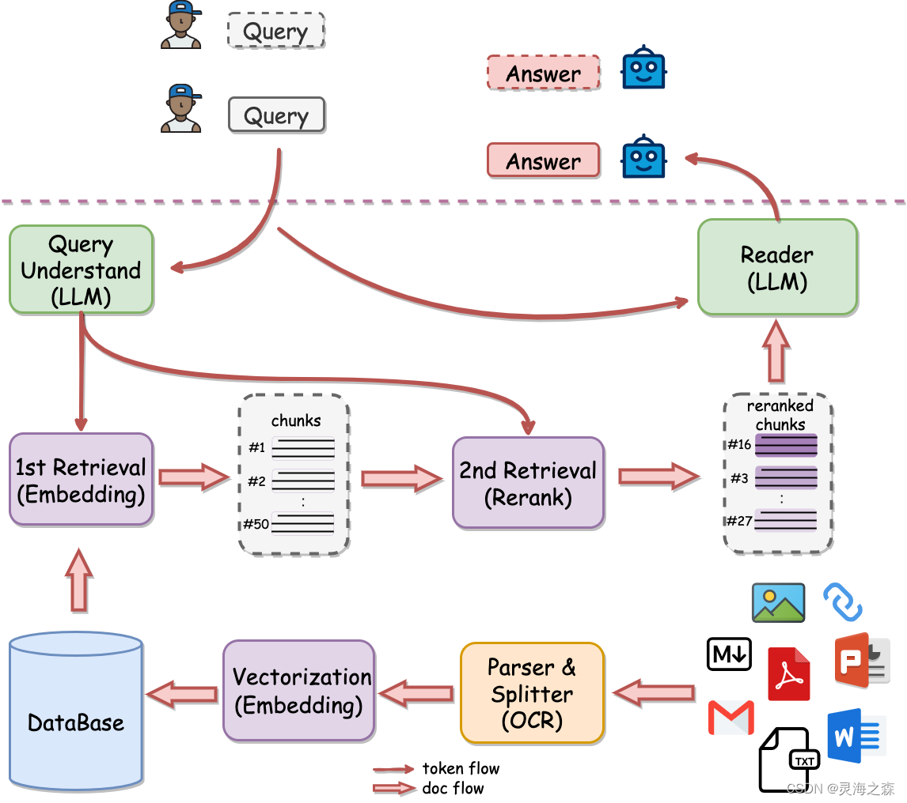

# Langchain+本地LLMs搭建本地RAG

## RAG基本工作流程

``` 
1. 检索（Retrieve）：
输入查询： 用户通过输入查询或问题来开始这个流程。
相似性搜索： 系统将用户查询通过嵌入模型转换为向量，并在外部知识源中的向量数据库中进行相似性搜索。
返回相关信息： 搜索会返回与查询最接近的前 k 个数据对象（上下文信息），这些对象来自于知识库、数据库或其他数据源。

2. 增强（Augment）：
填入模板： 用户查询与检索到的上下文信息被填入到一个提示模板中。
构建完整提示： 这个模板整合了查询和相关信息，构建出一个完整的提示词，用于指导模型生成。

3. 生成（Generate）：
输入到 LLM： 构建好的提示被输入到大型语言模型（LLM），比如 GPT 或 Qwen。
生成内容： 模型根据提示词中的信息生成相关内容，包括回答、文本或其他输出。

RAG 的优势：
即时性： 通过检索外部信息源，RAG 能够即时更新模型的知识，让其对实时性、非公开或离线的数据也能提供有效回应。
准确性： 注入的相关信息提升了模型输出的准确性，减少了幻觉问题。
数据安全： 可以在内部构建知识库，从而确保敏感数据不会外泄。
```

